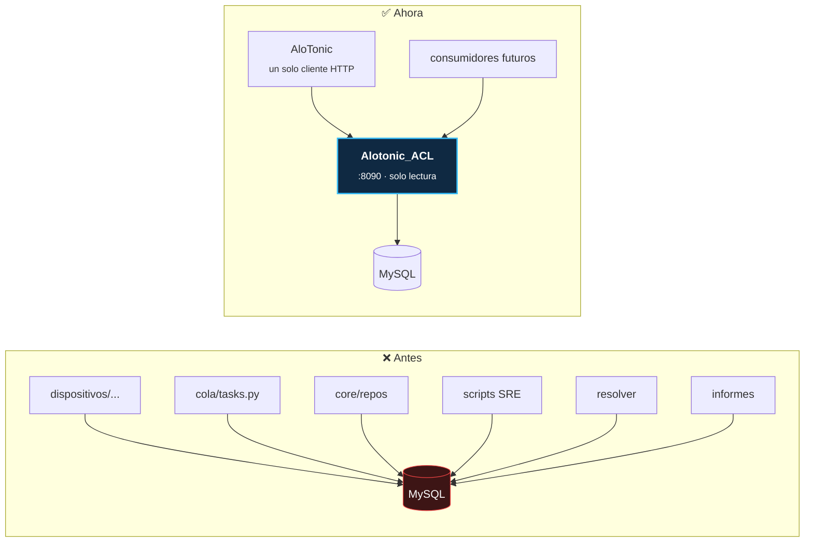
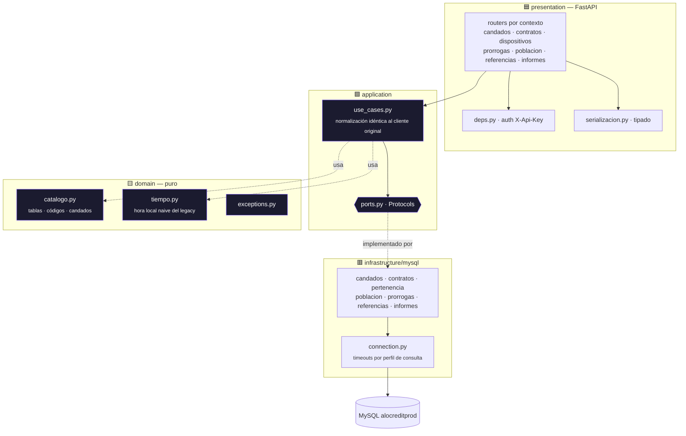
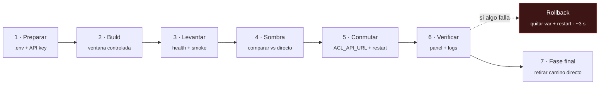

<div align="center">

# 🛡️ ALOTONIC_ACL
### Anti-Corruption Layer · MySQL `alocreditprod`


---

**La única puerta a la base legacy.** Toda consulta a la MySQL `alocreditprod` —contratos, cuotas,
titulares, candados, prórrogas de crédito, referencias por TAC— pasa por esta API. AloTonic ya no abre
una sola conexión MySQL directa, y ningún consumidor futuro tendrá que volver a aprender las trampas
del legacy: están encapsuladas aquí, una vez, con su propia suite.

[Por qué existe](#1-por-qué-existe) · [Arquitectura](#2-arquitectura-hexagonal) · [Trampas del legacy](#3-las-trampas-del-legacy) · [Endpoints](#4-superficie-http) · [Tipos](#5-fidelidad-de-tipos) · [Consumidor](#6-lado-alotonic-el-interruptor) · [Runbook](#7-runbook-de-despliegue-y-cutover) · [Entorno pre](#71-el-entorno-pre-misma-instancia) · [Seguridad](#8-seguridad) · [Calidad](#9-calidad)

</div>

---

## 1. Por qué existe

`alocreditprod` es una base de la que AloTonic **no es dueño**. Su esquema cambia sin aviso, mezcla
*collations* dentro de una misma vista, y codifica reglas de negocio en enteros sin documentar que
además **significan cosas distintas según la familia de producto**. Mientras estuvo embebida —`pymysql`
repartido por media docena de módulos de AloTonic— cada una de esas trampas era, en la práctica, un bug
de AloTonic.



Forma parte de la **constelación de AloTonic**: junto a los seis componentes de candado
(`ALOTONIC_paytrigger`, `_nuovo`, `_globetek`, `_motosafe`, `_knox`, `_trustonic`), este servicio
completa el desmontaje de los dos monolitos con los que AloTonic hablaba hasta agosto de 2026.

> **Diferencia de rol con los componentes.** Los componentes de candado hablan con **proveedores**
> (escriben: bloquean, desbloquean, prorrogan) y son autónomos entre sí. Este ACL habla con una **base
> de datos** y es estrictamente **de lectura**. No se llaman entre ellos: ningún componente consulta el
> ACL, y el ACL no sabe que los componentes existen.

### Principios que gobiernan el código

| Principio | Qué significa en la práctica |
|:--|:--|
| **Paridad primero** | El SQL, la sanitización, los *clamps* y los retornos degenerados son copia exacta del cliente que vivía dentro de AloTonic. Un cambio de comportamiento aquí es un incidente, no una mejora. Las mejoras deliberadas están comentadas con su fecha y su medición. |
| **Solo lectura** | No existe ningún endpoint de escritura. Verificado contra el histórico: producción jamás escribió SQL contra `alocreditprod`. |
| **Fidelidad de tipos** | `datetime`/`date`/`Decimal` viajan etiquetados y el cliente los reconstruye **idénticos** a los que devolvía pymysql (§5). |
| **Trampas encapsuladas** | Hora local naive, códigos por familia, *collations*, vistas incompletas: resueltos aquí y en ningún otro sitio (§3). |
| **Errores opacos hacia fuera, ruidosos hacia dentro** | El consumidor recibe `503`; el detalle del driver queda en logs con la ruta. |

---

## 2. Arquitectura hexagonal

La dependencia apunta hacia adentro. El dominio no sabe que existe MySQL; la infraestructura no sabe que
existe FastAPI.



```text
app/                                   1.708 líneas · 173 tests
├── domain/            hechos del legacy: catálogo de tablas/códigos, zona horaria, errores
│   ├── catalogo.py    DEVICE_FK · ESTADOS_NO_VIGENTES · ATRASADO_STATUS · MDM_CANDADO · TABLAS_PERTENENCIA
│   ├── tiempo.py      a_hora_local_legacy() · ahora_local_legacy()  (America/Bogota, naive)
│   └── exceptions.py
├── application/       puertos (Protocol) + casos de uso
├── infrastructure/    adaptadores MySQL — SQL copiado 1:1 del cliente embebido
└── presentation/      FastAPI: routers por contexto, auth, serialización tipada
```

---

## 3. Las trampas del legacy

Esta es la sección que justifica el servicio. Cada punto costó un incidente o una verificación contra
producción, y ahora vive resuelto en un solo sitio.

### 3.1. Los códigos de pago **significan cosas distintas** según la familia

No es intuitivo y es la fuente de error más cara de todo el legacy:

| Familia | Tablas | Impago | Ojo |
|:--|:--|:--|:--|
| **PHONE** | `contract/*` | `payment_status ∈ {3, 4}` | |
| **TWIST 1.0** | `twist_contract/*` | `payment_status ∈ {2, 3}` | **`4` = Pagado** ⚠️ |

El mismo entero, `4`, significa *impago* en una familia y *pagado* en la otra. Un cruce que asuma el
mismo código en ambas bloquea clientes al día.

> **`candado ≠ producto`.** La familia de producto y el sistema de candado son dimensiones
> independientes: un contrato PHONE puede llevar cualquier candado. Resolverlas juntas es un error
> clásico. `paytrigger_device` es el candado **ALOTONIC/GlobeTek**, no PayTrigger.

### 3.2. `view_general_contracts` estaba **rota en producción**

Su `UNION` interna hereda la *collation* de la sesión. Con el valor por defecto de pymysql
(`utf8mb4_general_ci`) revienta con `1271 Illegal mix of collations` — y así llevaba tiempo fallando
para el cliente original. El ACL alinea todas las ramas al abrir la consulta:

```python
# app/infrastructure/mysql/informes.py
cur.execute("SET NAMES utf8mb4 COLLATE utf8mb4_unicode_ci")
```

Un arreglo, en un sitio, para todos los consumidores presentes y futuros. Ese es exactamente el retorno
de tener un ACL.

### 3.3. Las horas son locales de Bogotá, **guardadas sin zona**

El legacy escribe hora local Colombia como *naive*. Interpretarla como UTC adelanta cualquier corte 5
horas — y los contenedores corren en UTC aunque la aplicación declare `America/Bogota`. `domain/tiempo.py`
encapsula la conversión para que ningún consumidor tenga que acordarse.

### 3.4. Vistas incompletas y estados no vigentes

- `ESTADOS_NO_VIGENTES = (4, 5, 6, 7, 8, 9)` — sin este filtro entran contratos cancelados y castigados.
- Varias vistas no traen todos los contratos: los adaptadores caen a la tabla real cuando la vista no
  resuelve, en vez de devolver "no existe" (que es lo que hacía fallar silenciosamente al resolver de
  proveedores).

### 3.5. Timeouts por perfil de consulta

No todas las consultas cuestan lo mismo. Las de informes barren vistas de decenas de miles de filas;
las puntuales resuelven por índice. `connection.py` aplica un `read_timeout` distinto según el perfil
(`mysql_read_timeout_informes`), para que una consulta pesada no arrastre el *pool* de las rápidas.

---

## 4. Superficie HTTP

Prefijo `/api/v1`, autenticación `X-Api-Key` en todas. **Ningún endpoint escribe.**

| Endpoint | Reemplaza a | Contexto |
|:--|:--|:--|
| `POST /candados/consultar` | `consultar_candados_alotonic` | candados |
| `GET /candados/prorrogas-credito/{imei}` | `prorrogas_credito_por_imei` | candados |
| `POST /contratos/productos` | `productos_por_imei_alocredit` | contratos |
| `POST /contratos/estado-pago` | `estado_pago_por_imei_alocredit` | contratos |
| `POST /contratos/estado-efectivo` | `estado_efectivo_alocredit` | contratos |
| `GET /contratos/estado-release/{imei}` | `estado_contrato_release_por_imei` | contratos |
| `GET /contratos/titular/{imei}?familia=` | `titular_contrato_por_imei` / `titular_twist_por_imei` | contratos |
| `POST /dispositivos/pertenencia` | tramo MySQL de `resolver_proveedores` | dispositivos |
| `GET /dispositivos/conteo/{tabla}` | diagnóstico COUNT del resolver | dispositivos |
| `GET /prorrogas/cortas-vencidas` | `prorrogas_cortas_vencidas` | prórrogas |
| `GET /prorrogas/nuevas?sistema=&desde=` | `imeis_con_prorroga_nueva` | prórrogas |
| `GET /poblacion/imeis` | `enumerar_imeis_candado_mdm` | población |
| `GET /poblacion/imei-modelo` | `enumerar_imei_modelo_candado_mdm` | población |
| `POST /referencias/por-tac` | `referencias_por_tac` | referencias |
| `GET /informes/contratos-lock-system` | consulta trustonic de `view_general_contracts` | informes |
| `GET /informes/catalogo-device-location` | consulta `view_device` de la sync horaria | informes |

`GET /health` es público, **no toca la base** y es el único endpoint sin autenticación.
Swagger/OpenAPI está **apagado**: es un servicio interno y su superficie no se publica.

---

## 5. Fidelidad de tipos

`pymysql` devuelve `datetime`, `date` y `Decimal`. JSON no tiene ninguno de los tres. Convertirlos a
texto o a `float` habría cambiado silenciosamente cálculos de cuota y comparaciones de fecha — el tipo
de fallo que no lanza excepción y aparece semanas después en una cifra que no cuadra.

La serialización va **etiquetada** y el cliente reconstruye el tipo exacto:

```jsonc
{"$tipo": "datetime", "$v": "2026-08-25T23:59:59"}   // vuelve a ser datetime
{"$tipo": "date",     "$v": "2026-08-25"}            // vuelve a ser date
{"$tipo": "decimal",  "$v": "1250000.00"}            // vuelve a ser Decimal, sin pasar por float
```

**Validado en sombra antes del cutover:** 18 de 18 comparaciones idénticas entre el ACL y el camino
MySQL directo — no solo los valores, también los **tipos** de cada campo.

---

## 6. Lado AloTonic: el interruptor

`core/infrastructure/acl_api_client.py` es el espejo HTTP del repositorio. El cambio de camino es **por
configuración**, nunca por despliegue:

```bash
ACL_API_URL=http://alotonic_acl:8090
ACL_API_KEY=<key>
# ausente → AloTonic vuelve a su camino MySQL directo, que sigue en el código, intacto
```

- **Sin** las variables → camino MySQL directo (estado previo, cero cambio de comportamiento).
- **Con** ellas → el repositorio `candados_alotonic_repository`, el resolver de proveedores y las tasks
  con SQL ad-hoc delegan **todo** en esta API.

El cliente trocea las listas de IMEIs en bloques de 1000 para no reventar el cuerpo de la petición, y
reconstruye los tipos de §5.

> La suite de AloTonic **borra estas variables del entorno** en `orquestador/settings/testing.py`. El
> `.env` de producción se carga bajo pytest, y sin ese saneamiento los tests del camino directo
> enrutarían por el ACL sin ejercitar lo que creen ejercitar.

---

## 7. Runbook de despliegue y cutover

> ⚠️ **La instancia es PRODUCCIÓN EN VIVO.** Revisar `free -h`, `df -h` y `uptime` antes de cualquier
> build. Orden estricto, sin saltarse pasos.



1. **Preparar** — `cp .env.example .env`, copiar los `MYSQL_*` del `.env` de AloTonic, generar la clave:
   `python -c "import secrets; print(secrets.token_urlsafe(48))"` → `ACL_API_KEYS`.
2. **Build** — `docker compose build`. La imagen es pequeña (`python:3.12-slim`, sin toolchain).
3. **Levantar** — `docker compose up -d` y comprobar:
   ```bash
   curl -s localhost:8090/health
   curl -s -H "X-Api-Key: $KEY" "localhost:8090/api/v1/dispositivos/conteo/nuovo"
   ```
4. **Sombra** (recomendado) — comparar respuestas del ACL contra el camino directo con IMEIs conocidos,
   **verificando tipos además de valores**.
5. **Conmutar** — añadir `ACL_API_URL` y `ACL_API_KEY` al `.env` de AloTonic;
   `docker restart alotonic-web-1` + workers Celery. *Downtime* ~3 s.
6. **Verificar** — panel de soporte (consultar IMEI), resolver en una notificación, `grep "via ACL"` en
   logs. Los errores del ACL responden `503` y se registran con su ruta.
7. **Rollback inmediato** — quitar `ACL_API_URL` del `.env` y reiniciar. Vuelve el camino directo sin
   tocar código ni desplegar nada.
8. **Fase final** (tras días estables) — retirar de AloTonic el camino MySQL directo (los bloques `else`
   de la fachada) y la dependencia `pymysql` de esos módulos.

### 7.1. El entorno pre (misma instancia)

El paso 4 (sombra) y cualquier prueba de contrato se hacen contra el **entorno pre**, que convive con
producción en la misma EC2. Se levanta entero —AloTonic, este ACL y los seis componentes— con un solo
comando, desde el repo de AloTonic:

```bash
cd /opt/alotonic
./pre.sh init          # solo la primera vez: genera los .env.pre con secretos propios de pre
./pre.sh up            # levanta todo; este servicio queda en http://127.0.0.1:8190/health
./pre.sh logs acl      # logs del ACL de pre
./pre.sh down          # baja solo pre
```

|  | producción | pre |
|---|---|---|
| Contenedor | `alotonic_acl` | `alotonic_acl_pre` |
| Imagen | `alotonic-acl:latest` | `alotonic-acl:pre` |
| Puerto publicado | `127.0.0.1:8090` | `127.0.0.1:8190` |
| Puerto interno | `8090` | `8090` — no cambia, lo fija el `CMD` de la imagen |
| Red docker | `alotonic_default` | `alotonic_pre` |
| `ACL_API_URL` en AloTonic | `http://alotonic_acl:8090` | `http://alotonic_acl_pre:8090` |

El compose de pre es **`docker-compose.pre.yml`**, en este mismo repo, con imagen `:pre` para que un
build de pre no pueda reemplazar la que sirve producción, y en la red `alotonic_pre`, desde la que no se
resuelve ningún contenedor de producción.

**Las credenciales de `alocreditprod` nacen VACÍAS en `.env.pre`**, aunque este servicio sea
solo-lectura: heredar secretos de producción es una decisión del dueño, no un efecto colateral de
levantar un entorno. Sin ellas el servicio arranca y `/health` responde; las consultas fallan con error
de conexión, que es exactamente el fallo que se quiere ver, en vez de un pre leyendo otra base en
silencio. Para habilitarlas:

```bash
cd /opt/alotonic && ./pre.sh init --inherit-legacy-reads && ./pre.sh restart acl
```

Runbook completo del entorno: **`/opt/alotonic/docs/entorno-pre.md`**.

### 7.2. Desplegar el ACL junto al resto

Para desplegar solo este servicio, los pasos 2-3 de arriba. Para desplegar **toda la constelación** en
orden (ACL → los 6 componentes → AloTonic), con *healthcheck* entre pasos y abortando si uno falla:

```bash
cd /opt/alotonic && ./deploy.sh --build-all
```

El ACL va **primero** a propósito: AloTonic lo consulta para resolver candados e informes, así que debe
estar actualizado antes de que entre en vivo el código nuevo que lo llama.

---

## 8. Seguridad

- **API key obligatoria**, comparación en tiempo constante. **Sin claves configuradas se rechaza todo**
  (falla cerrado, no abierto).
- **Puerto publicado solo en loopback** (`127.0.0.1:8090`). AloTonic llega por la red docker
  `alotonic_default`. No hay superficie expuesta a la red.
- **Contenedor sin privilegios** (usuario `acl`), imagen slim sin toolchain de compilación.
- **Solo lectura por diseño**: no hay ruta que escriba, ni el usuario MySQL la necesita.
- **Errores opacos**: el consumidor recibe un `503` genérico; el detalle del driver —que puede filtrar
  estructura de tablas— queda solo en logs.
- **Sin secretos en el repositorio**: `.env` nunca versionado, `.env.example` con placeholders,
  verificado en CI.

---

## 9. Calidad

```bash
make venv    # crea .venv e instala dependencias (con nice/ionice: la instancia es prod)
make test    # pytest con gate de cobertura (falla el build si baja de 96 %)
make lint    # flake8
```

| Métrica | Valor |
|:--|:--|
| Cobertura | **100 %** (gate `--cov-fail-under=96`, con *branch coverage*) |
| Tests | **173**, en 9 módulos: unitarios de dominio, adaptadores MySQL contra dobles, y API |
| Código | 1.708 líneas en `app/` |

Los tests no comprueban "que no explota": verifican el **SQL emitido**, los formatos de fecha, los
códigos por familia de producto, la reconstrucción de tipos y los caminos degenerados (IMEI inexistente,
vista incompleta, base caída). El *branch coverage* está activo a propósito — en código de paridad, la
rama no tomada es justo donde se esconde la diferencia de comportamiento.

---

<div align="center">

**Alotonic_ACL** — Core Engineering Systems · AloCredit

*La única puerta al legacy · Hexagonal · Solo lectura · Paridad verificada*

</div>
